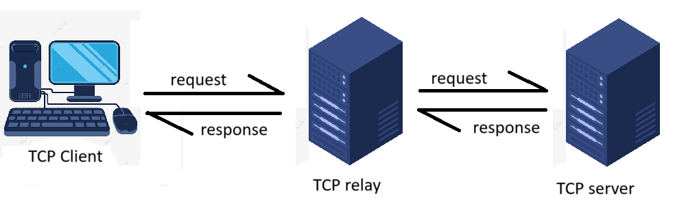
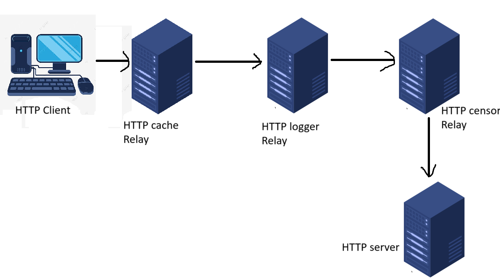

# Network Programming Mini-Project 1 Report
## Table of contents
1. [Introduction](#introduction)
2. [Code structure](#code-structure)
3. [Exo1](#exo1)
4. [Exo2](#exo2)
5. [Notes](#notes)
5. [Usage](#usage)

## Introduction

In this mini project for the PROGRES (Network Programming) course, we aim to implement TCP Proxy servers, also known as TCP relays, to function as intermediaries between clients and servers. The objective is to develop a basic TCP proxy server **(Exo1)** capable of forwarding data between a client and server, which can later be modified to handle more complex tasks **(Exo2)**.

## Code structure
Each Python file in this project follows the standard structure using the `if __name__ == "__main__"` block. Within this block, a primary function—either `start_server()`, `start_relay()`, or `start_client()`—is defined and executed. This function is responsible for running the core logic of the program, depending on whether it's acting as a server, relay, or client.

The relays will utilize two main functions to manage client requests and facilitate communication with the servers:

- `fetch_from_server()`: This function is responsible for transmitting the client's request to the server (or the next level relay) and returning the response as a variable.
- `handle_client()`: This function is responsible for processing client requests, analyzing them, and taking the appropriate action based on the request.

In Exercise 2, the code for the logger and censor relays includes two functions that log client requests based on their type:

- `log_requests()`: This logger relay function accepts the IP address, the URI, and its response as arguments, and logs this information.  
    example of a resulting request.log file :
    ```log
    2024-10-10 21:24:58,390 - Client 127.0.0.1 requested URI / and received a response of 2551 bytes
    2024-10-10 21:25:07,159 - Client 127.0.0.1 requested URI /webpage and received a response of 981 bytes
    2024-10-10 21:25:29,060 - Client 127.0.0.1 requested URI /bannedpage and received a response of 26 bytes
    ```

- `log_banned_requests()`: This censor relay function takes the IP address and the banned URI as arguments, and logs this information.  
    example of a resulting banned_requests.log file
    ```log
    2024-10-10 21:25:29,059 - Client 127.0.0.1 requested BANNED URI /bannedpage
    2024-10-10 21:39:36,069 - Client 127.0.0.1 requested BANNED URI /bannedpage
    ```

The libraries used to implement the relays are:

- **Socket**: For network communication.
- **Threads**: To handle concurrent client requests.

To log information, we used the **logging** library.

To access files (only in the HTTP server from TME1), we utilized **Pathlib**.

## Files
```bash
|-- Exo1
|   |-- ClientTCP.py
|   |-- ServerTCP.py
|   |-- relayTCP.py
|-- Exo2
|   |-- WebPages
|   |   |-- bannedpage.html
|   |   |-- index.html
|   |   |-- webpage.html
|   |-- HTTPrelay_cache.py
|   |-- HTTPrelay_logger.py
|   |-- HTTPrelay_censor.py
|   |-- HTTPserver.py
|-- README.md
|-- Topology1.png
|-- Topology2.png
```
## Exo1
For this exercise, we will use the TCP client and server from the TME1, 2nd exercise. We will implement a simple TCP relay that forwards the client's message to the TCP server, retrieves the response, and then sends it back to the client.

The connection will follow these steps:

1. The client connects to the proxy server.
2. The client sends a message or request to the proxy.
3. The proxy server connects to the TCP server.
4. The proxy server forwards the message to the TCP server.
5. The TCP server sends a response back to the proxy server.
6. The proxy server sends the response to the client.
7. The client closes the connection with the proxy server.
8. The proxy server closes the connection with the TCP server.


We will follow the topology below : 


### TCP Relay
The TCP relay in this exercise will perform the basic task of receiving client requests and fetching responses from the server.

Using the TCP socket, we bind the relay's address to a port number on which it will listen. By calling `socket.listen(5)`, the relay can handle a maximum of 5 clients waiting for a connection.

The relay will call the `handle_client()` function, which will accept incoming TCP connections and receive client requests. It will then call the `fetch_from_server()` function to retrieve the response from the server and send it back to the client.

## Exo2
For this second exercise, we will use the HTTP server from the TME1, 3rd exercise, and modify the relay from the first exercise of this project to implement the following relays:

1. **HTTP Cache Relay**: This relay will forward the HTTP client request to the server and store the response upon the first request to a URI. For subsequent requests to the same URI, it will utilize the cached response for the same or other clients.

2. **HTTP Logger Relay**: This relay will log and archive every requested URI along with the IP address of the client. It will forward the request to the HTTP server and archive any non-empty responses as well.

3. **HTTP Censor Relay**: Acting as a filter relay, this relay will check if the requested URI is on its list of banned pages. If the URI is banned, it will respond with a forbidden message (HTTP 403) and log the IP address of the client along with the banned URI requested. If the URI is not banned, it will forward the request to the HTTP server and send the response back to the client.

We will follow the topology below : 


### Cache Relay
The purpose of the cache relay is to reduce network traffic by caching web server responses and to decrease the round-trip time (RTT) of client requests. The cache relay will be implemented using a dictionary called `cache` to store the URI and its corresponding response.

In the `handle_client` function, we will parse the requested URI from the `GET` request and check if the response for this URI is in the cache. If it is, the relay will reply to the client directly from the cache and send logging information to the logger relay in the following format: 

```bash
logging,IP_ADDRESS,URI,URI_RESPONSE
```

If the response is not found in the cache, the HTTP request will be transmitted to the server to retrieve the URI's response and cache it for future use. Additionally, the cache relay will send the client HTTP request with an added prefix that includes the IP address of the client, formatted as follows:

```bash
IP_ADDRESS GET URI HTTP/1.1 .....
```
### Logger Relay
The purpose of the logger relay is to archive client requests, which can then be used for audits or other purposes. To accomplish this, we created a function called `log_requests` and a log file named `requests.log`.

First, the logger will check the received request and perform the following actions:

- If the request starts with the word **logging**, it will retrieve the information that follows: the IP address, the URI, and the response. It will log these details and close the connection.
- If the request does not start with **logging**, it will separate the request at the first space `" "` to retrieve the IP address of the client and the `GET` request which then can be used to log the information. It will then transmit the same request received `IP_ADDRESS GET URI HTTP/1.1 ..` to the censor relay.

The `log_requests` function will receive three arguments: the source IP address, the requested URI, and the URI response:
- If the response is empty, it will log only the IP address and the requested URI, indicating that it received an empty response.
- If the response is not empty, it will log the IP address and URI along with the length of the response in bytes.


### Censor Relay
The censor relay is designed to filter traffic and prevent access to banned pages. These pages will be stored in a list called `banned_pages`, which will be checked each time an HTTP `GET` request is received by the relay. It will parse the URI from the request and check if it exists in the list of banned pages. If the URI is forbidden, the censor relay will send back a `HTTP/1.1 403 Forbidden` response, denying access to the page without relaying anything to the web server. 

If the requested URI is not a forbidden page, the censor will relay the request to the web server and send back the HTTP response to the client.

To archive the clients that requested a banned page, we created a function called `log_banned_request()`, which takes the IP address and URI as arguments and logs the message:

**Client X.X.X.X requested BANNED URI /page**

Additionally, it is important to note that the censor relay also receives the request in the format `IP_ADDRESS GET URI HTTP/1.1 ...`, so it will separate the request at the first space `" "` to extract the IP address and the `GET` request.

## NOTES

### 1. Relays
- **Banned Pages**: 
  - The cache relay will not cache responses for banned pages. This ensures that requests for these pages are routed to the HTTP censor relay for proper logging.
  
- **Topological Integration**: 
  - The relays are designed to function within a specific topology. While it is possible to use each relay individually between the client and the server, this would require code modifications.
  
- **Response Logging**: 
  - Instead of archiving the complete non-empty response (which may include extensive HTML content), the logger relay will log only the size of the response (in bytes).

- **Logging files**:
    - The logging files if not in the directory, will be created when running the relays.
### 2. Port Numbers and Addresses
- **Localhost Configuration**: 
  - In the provided code, it is assumed that the relays and the HTTP server will run on the same machine. Therefore, the `fetch_from_server` function connects to `localhost`, and each relay/server binds its socket to a different port number to avoid conflicts.

- **Remote Configuration**: 
  - If each server/relay is executed on different machines, the same port number can be used for each. The code should be modified to specify the correct IP address of the machine running the server. An input method can also be implemented to set the IP address of the next server for each relay at startup.

### 3. Threading
- **Handling Connections**: 
  - Threading is implemented for each server/relay to manage multiple TCP client connections. However, running all these servers on the same machine might complicate the use of a thread pool larger than one, given that there are three relays and one server.
  
- **Deployment Considerations**: 
  - In a deployment scenario where the servers are distributed across different machines, a thread pool of four or more can be utilized, depending on the processor and the number of cores available.

## Usage

### Exercise 1
To connect from the client to the server, we need to run the relay and server in the following order:

- **relayTCP**:
```bash
cd Exo1  
~Exo1> python3 relayTCP.py  
```

- **serverTCP**:
```bash
~Exo1> python3 ServerTCP.py  
```

- **clientTCP**:
```bash
~Exo1> python3 ClientTCP.py  
```

You will be prompted with the following line:
```bash
input the address of the server (press enter if your server is on the same machine):  
```
You should enter the IP address of the TCP relay.

### Exercise 2
To connect a web browser to the HTTP server through the relays, we need to run the `.py` files of each relay and the HTTP server. We follow the same method of `python3 filename.py`, but we should position ourselves in the `Exo2` directory.

- **HTTP server**:
```bash
cd Exo2  
~Exo2> python3 HTTPserver.py  
```

- **Censor relay**:
```bash
~Exo2> python3 HTTPrelay_censor.py  
```

- **Logger relay**:
```bash
~Exo2> python3 HTTPrelay_logger.py  
```

- **Cache relay**:
```bash
~Exo2> python3 HTTPrelay_cache.py  
```

Then, on a web browser, you should access the cache relay using the following format:
```bash
http://<IP_ADDRESS>:<PORT>  
```
